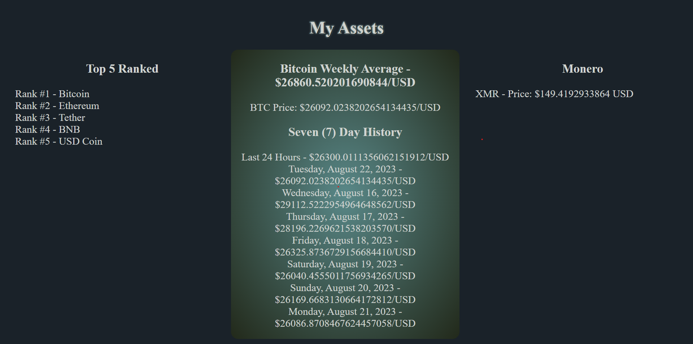

# Introduction

Hello, this is a simple submission to show node.js and API usage.

A simple ```npm i``` and ```npm run start``` will get you up and running.

For this project I used Lit and the Coincap API.

The Lit Documentation can be found [here](https://lit.dev/docs/getting-started/)
The API and its documentation can be found [here](https://docs.coincap.io/)



### Steps I took

1. Create a fork.
1. Clone your fork to your local machine.
1. Write your code. This code accomplishes the following.
   1. Retrieve and display a list of assets, ranked 1-5.
   1. Retrieve the asset monero. Display the symbol and current price rounded up to the hundredths place.
   1. Retrieve the asset bitcoins daily price history. Display the average of one week of price data.
1. Push your changes.


### Thank You

I appreciate the time and opportunity. I truly enjoyed it.

